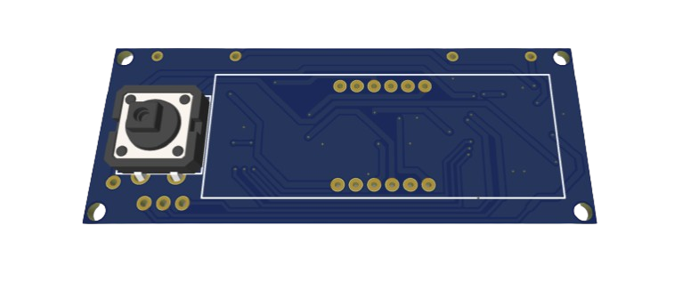
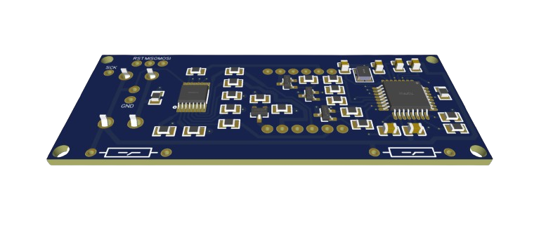
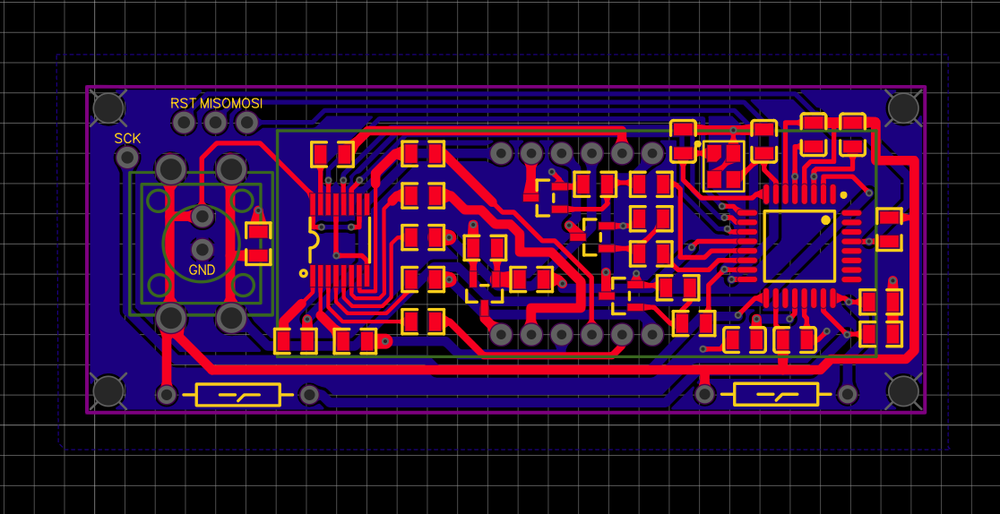

## Timer with Extremely Low Power Consumption on ATmega328

**Project Overview**

This project demonstrates how to build a fully functional electronic device — from scratch to a finished SMT PCB.

The device is a timer that measures the time between two triggers from optical sensors. The measured time is displayed on a 4-digit 7-segment indicator. The user can reset the timer at any moment. The microcontroller used is the ATmega328.

The main focus of this project is energy consumption control. Since the device is powered by a single CR2032 battery and must remain always active, it enters deep sleep mode after a timeout, reducing power consumption to just a few µAs.

Here are some screenshots of the PCB production process:

**Top View**

**Bottom View**

**Layout**

